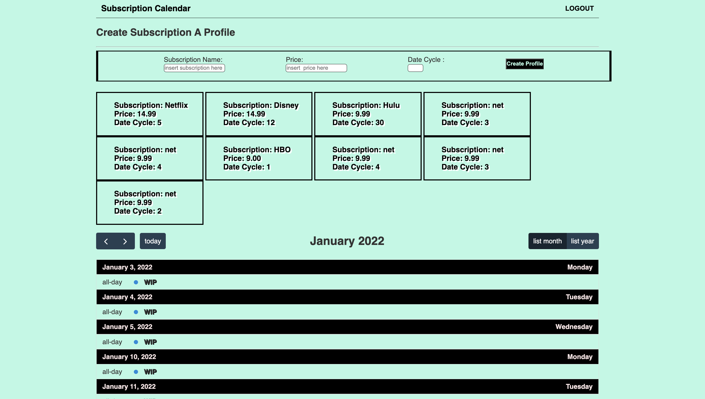

## SubTrakd Subscription Calendar
   
### Description

*A mysql database and CMS-style Calendar built using Model View Controller (MVC) paradigm. Built using MySQL2, Express, Sequelize, Handlebars and dotenv*

A simple Calendar app that will help you keep track of your recurring subscriptions when you input your info!


### Application Deployment
https://subtrakd.herokuapp.com/


### Application Screenshot


  

### Installation Guidelines

- Add a .env file to the root of the project

```text
DB_NAME='tech_blog_db'
DB_USER='root'
DB_PW='XXX'
```